# Pair Claude Architecture

## Overview

Pair Claude implements a multi-agent pair programming system with three distinct roles: Architect (planning), Navigator (review/safety), and Driver (implementation). The system uses MCP (Model Context Protocol) servers for inter-agent communication, enabling language-agnostic agent swapping.

## Architecture Diagram

```mermaid
graph TB
    subgraph "Main Process - Orchestrator"
        O[Orchestrator]
        O --> PF[Permission Flow Handler]
        O --> RF[Review Flow Handler]
        O --> HTTP[HTTP MCP Server]
    end

    subgraph "HTTP MCP Server Endpoints"
        HTTP --> N_EP["/mcp/navigator endpoint"]
        HTTP --> D_EP["/mcp/driver endpoint"]
    end

    subgraph "Navigator Agent Process"
        N[Navigator Instance]
        N -->|HTTP/SSE| N_EP
        N_EP --> N_SERVER[Navigator MCP Server]
        N_SERVER --> N_TOOLS["🔧 Navigator Tools:<br/>• navigatorApprove<br/>• navigatorDeny<br/>• navigatorCodeReview"]
    end

    subgraph "Driver Agent Process"
        D[Driver Instance]
        D -->|HTTP/SSE| D_EP
        D_EP --> D_SERVER[Driver MCP Server]
        D_SERVER --> D_TOOLS["🔧 Driver Tools:<br/>• driverRequestReview<br/>• driverRequestGuidance"]
    end

    %% Flow connections
    D -.->|"1. Tool calls"| O
    O -.->|"2. User messages"| N
    N -.->|"3. Tool responses"| O
    O -.->|"4. User messages"| D

    %% Styling
    classDef agent fill:#e1f5fe
    classDef orchestrator fill:#fff3e0
    classDef mcp fill:#f3e5f5
    classDef tools fill:#e8f5e8

    class N,D agent
    class O,PF,RF orchestrator
    class HTTP,N_EP,D_EP,N_SERVER,D_SERVER mcp
    class N_TOOLS,D_TOOLS tools
```



## Communication Flows

### 1. Review Flow (Asynchronous Quality Feedback)

**Purpose**: Driver requests feedback on implementation progress


### 2. Permission Flow (Synchronous Security Gate)

**Purpose**: Intercept and approve dangerous operations (Write/Edit/MultiEdit)

```mermaid
sequenceDiagram
    participant D as Driver Agent
    participant O as Orchestrator
    participant N as Navigator Agent

    Note over D: Wants to edit a file...

    D->>+O: Attempts Write/Edit tool
    Note over O: canUseTool intercepts

    O->>O: Check if toolName needs approval
    alt Needs approval (Write/Edit/MultiEdit)
        O->>O: Flush driverBuffer transcript
        O->>+N: reviewPermission(PermissionRequest)
        Note over N: Receives permission request as user message

        N->>N: Analyze request using tools
        N->>+N: Calls navigatorApprove OR navigatorDeny
        Note over N: Tool returns empty content (communication-only)

        N->>-O: PermissionResult{allowed: true/false, reason/comment}

        alt Permission granted
            O->>-D: {behavior: "allow", updatedInput}
            Note over D: Tool executes successfully
        else Permission denied
            O->>-D: {behavior: "deny", message}
            Note over D: Tool execution blocked
        end
    else No approval needed
        O->>-D: {behavior: "allow", updatedInput}
        Note over D: Tool executes immediately
    end
```

## Key Design Principles

### 1. **Agent Isolation**
- Each agent runs in its own context with dedicated MCP endpoints
- Agents communicate only through structured MCP tools
- No direct agent-to-agent communication

### 2. **Orchestrator Mediation**
- All inter-agent communication flows through the orchestrator
- Orchestrator handles protocol translation (DriverCommand ↔ user messages ↔ NavigatorCommand)
- Orchestrator manages timing, buffering, and flow control

### 3. **MCP Tool Semantics**
- **Navigator tools**: Communication-only (empty content arrays)
  - Tool call itself carries meaning: "I approve", "I deny", "I review"
- **Driver tools**: User-visible feedback (descriptive content)
  - Provide status updates: "🔍 Requesting review: authentication flow"

### 4. **Flow Separation**
- **Review Flow**: Async, quality-focused, batch-oriented
- **Permission Flow**: Sync, security-focused, real-time interception

## Multi-Agent Extensibility

This architecture enables agent swapping:


**Requirements for new agents:**
1. Implement appropriate MCP tool endpoints (`/mcp/navigator` or `/mcp/driver`)
2. Expose correct tool vocabulary (Navigator: approve/deny/review, Driver: requestReview/requestGuidance)
3. Handle user messages from orchestrator
4. Return structured tool calls with expected schemas

## Environment Configuration

```bash
# Timeout configuration
PAIR_TOOL_TIMEOUT_MS=120000        # Tool completion timeout (default: 2 minutes)
PAIR_PERMISSION_TIMEOUT_MS=15000   # Permission request timeout (default: 15 seconds)

# Turn limits
PAIR_NAVIGATOR_MAX_TURNS=20        # Navigator conversation limit
PAIR_DRIVER_MAX_TURNS=20           # Driver conversation limit
```

## File Organization

- `src/mcp/httpServer.ts` - HTTP server with SSE endpoints for MCP communication
- `src/utils/mcpServers.ts` - MCP server configurations and tool name exports
- `src/utils/mcpTools.ts` - Individual MCP tool definitions with Zod schemas
- `src/conversations/` - Agent implementations (Navigator, Driver, Architect)
- `src/index.ts` - Main orchestrator with flow handling logic
- `src/utils/timeouts.ts` - Shared timeout utilities and configuration